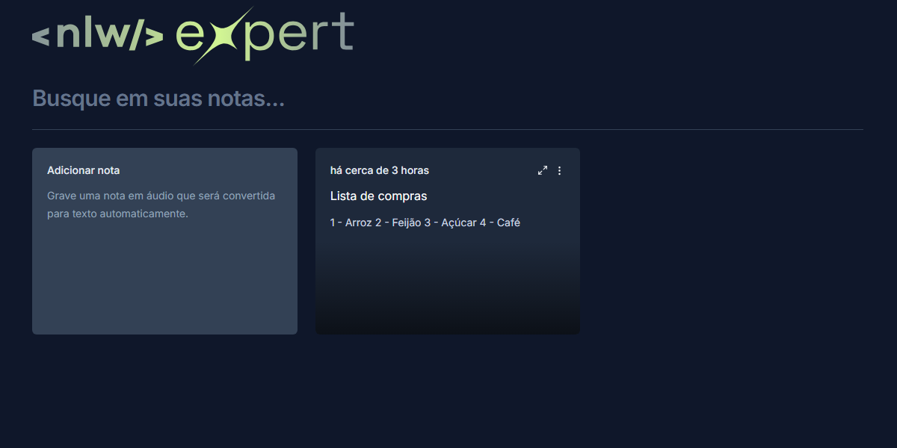

<h1 align="center" style="font-weight: bold;">Project name 💻</h1>

 <a href="#technologies">Technologies</a> • 

<h2 id="layout">🎨 Layout</h2>

    

<h2 id="technologies">💻 Technologies</h2>

- react
- tailwind css
- vite